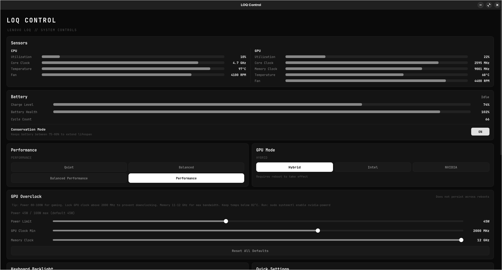
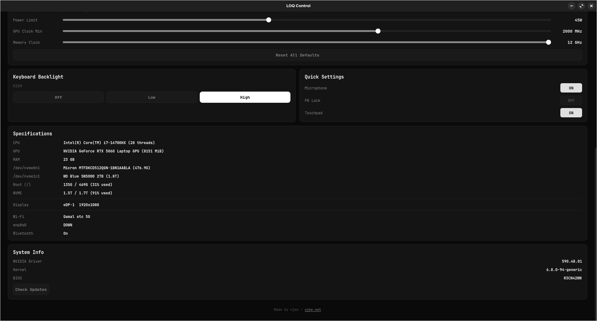

# LOQ Control

A desktop control center for Lenovo LOQ laptops on Linux. Built with PyQt5.

Inspired by [LenovoLegionToolkit](https://github.com/BartoszCichecki/LenovoLegionToolkit) — bringing similar functionality to Linux natively.




## Features

- **Sensors** — Real-time CPU & GPU monitoring (utilization, clock speed, memory clock, temperature, fan RPM)
- **Battery** — Charge level, health, cycle count, and conservation mode toggle (75-80% charge limit)
- **Performance Profiles** — Quiet, Balanced, Balanced Performance, Performance
- **GPU Mode** — Switch between Hybrid, Intel, and NVIDIA (requires reboot)
- **GPU Overclock** — Power limit, GPU clock lock, and memory clock control with guidance tips
- **Keyboard Backlight** — Off / Low / High
- **Quick Settings** — Microphone, FN Lock, Touchpad toggles
- **Specifications** — CPU, GPU, RAM, disks, display, network info
- **System Info** — NVIDIA driver, kernel, BIOS versions with update checker

## Tested On

- **Laptop:** Lenovo LOQ 16IRX9 (83JE)
- **CPU:** Intel Core i7-14700HX
- **GPU:** NVIDIA GeForce RTX 5060 Laptop GPU
- **OS:** Zorin OS 17.3 (Ubuntu 24.04 based)
- **Kernel:** 6.8.0+
- **Session:** Wayland (GNOME)

## Requirements

- Python 3
- PyQt5
- NVIDIA drivers with `nvidia-smi`
- `legion_laptop` kernel module (loaded by default on supported hardware)
- `ideapad_acpi` kernel module

### Install dependencies

```bash
sudo apt install python3-pyqt5
```

## Usage

```bash
chmod +x loq-control.py
./loq-control.py
```

Some features require root access (performance profiles, conservation mode, GPU overclock, fan RPM reading). The app uses `sudo` for these operations — you may want to run it with `pkexec` or configure passwordless sudo for the relevant paths.

## How It Works

| Feature | Backend |
|---|---|
| Performance profiles | `/sys/firmware/acpi/platform_profile` |
| Conservation mode | `/sys/bus/platform/drivers/ideapad_acpi/VPC2004:00/conservation_mode` |
| FN Lock | `/sys/bus/platform/drivers/ideapad_acpi/VPC2004:00/fn_lock` |
| Keyboard backlight | `/sys/class/leds/platform::kbd_backlight/brightness` |
| CPU sensors | `/proc/stat`, `/sys/devices/system/cpu/*/cpufreq/`, `/sys/class/thermal/` |
| GPU sensors | `nvidia-smi` batch query |
| Fan RPM | `legion_laptop` WMI3 debug interface |
| GPU overclock | `nvidia-smi -pl`, `nvidia-smi -lgc`, `nvidia-smi -lmc` |
| GPU mode | `prime-select` |
| Microphone | `pactl` |
| Touchpad | `gsettings` |

## Notes

- GPU overclock settings do not persist across reboots
- GPU mode changes require a reboot
- The `balanced-performance` profile is a hidden mode exposed by the kernel's `platform_profile` driver that Lenovo Vantage on Windows does not surface
- Fan RPM uses the WMI3 access method via the `legion_laptop` debug interface, as the default EC method returns 0 on some LOQ models

## License

MIT

## Author

**ojee** — [ojee.net](https://ojee.net)
