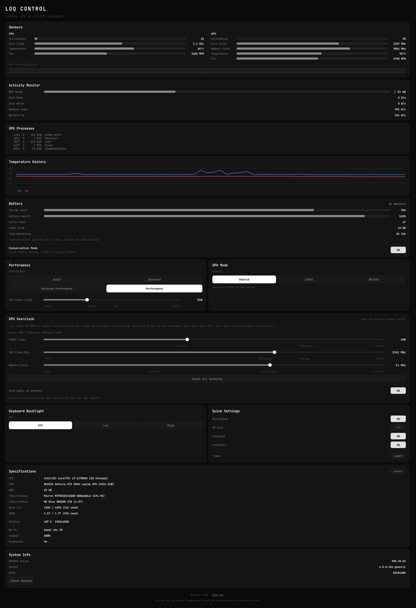

# ojee-loq

Hardware monitoring and control for Lenovo LOQ laptops on Linux — as a desktop
app, as a headless agent, and as a web module you can reach from your phone.

Inspired by [LenovoLegionToolkit](https://github.com/BartoszCichecki/LenovoLegionToolkit) — bringing similar functionality to Linux natively.



## Three ways to run it

| | What it is | Install |
|---|---|---|
| **Desktop app** | PyQt5 control centre, runs as you, no service | `./install.sh` |
| **Agent** | Headless HTTP + SSE service on the machine itself | `sudo ./install-agent.sh` |
| **Web module** | The same four screens in a browser — standalone, or mounted into [ojee-console](https://github.com/0J33/ojee-console) | comes with the agent |

All three read hardware through the same `hardware.py`, so a reading is a
reading no matter which one you are looking at. The desktop app and the web
module use the same four views — **Monitor / Power / Battery / System** — so
switching between them costs you nothing.

The web UI is built on [ojee-ui](https://github.com/0J33/ojee-ui) and the Qt
palette is *generated from the same CSS tokens* at runtime (`theme.py`), which
is what stops the two surfaces drifting apart.

## Security model

The agent is reachable by anyone on your tailnet holding its bearer token, so
"what can this thing actually do to my laptop" needs a short answer:

- **The agent does not run as root.** It runs as a normal user.
- Every privileged action goes through **one root-owned helper script**
  (`loq-privhelper`) with a fixed verb list that validates every argument
  before it reaches a device.
- `sudoers.d/ojee-loq` grants NOPASSWD on **that one file and nothing else**.

That indirection is the whole model, and the obvious shortcuts are all worse:

| Tempting grant | Why it is not used |
|---|---|
| `sudo tee <path>` | overwrites **any** root-owned file — `/etc/shadow`, `/etc/sudoers` |
| `sudo sh -c <string>` | a root shell with extra steps |
| `sudo cat <path>` | reads any root-owned file |
| `sudo chmod` | makes any root-owned file world-readable |

Read [`loq-privhelper`](loq-privhelper) once and you know the full extent of
what the token can do. It is deliberately boring.

Beyond that:

- The agent **binds to the Tailscale address by default**, never `0.0.0.0`. If
  Tailscale is down it falls back to loopback — it starts unreachable rather
  than starting wide open.
- **Advanced controls are off by default** (`LOQ_ALLOW_ADVANCED=0`). CPU TDP,
  GPU clocks, TGP and GPU mode can make a machine unstable, and the failure
  mode is one you have to walk over to.
- Advanced changes **auto-revert** after 15s unless confirmed. A phone that
  loses signal mid-drag cannot leave a machine mis-clocked with nobody at the
  keyboard.
- **Process kill is capped at the agent's own UID** and never escalates. The
  web module can end exactly what you could end from a shell on that box.

## Features

The desktop app and the web module have **full parity** — every control listed
here is available in both.

### Monitoring
- **Sensors** — Real-time CPU & GPU utilization, clock speed, memory clock, temperature, fan RPM with progress bars
- **Per-Core CPU Heatmap** — Visual grid showing utilization of every CPU core
- **Temperature History** — Rolling 3-minute line graph of CPU and GPU temperatures
- **Thermal Throttle Detection** — Real-time alert when CPU or GPU is being throttled
- **Activity Monitor** — RAM usage, disk read/write speed, network upload/download speed
- **GPU Processes** — List of processes currently using the NVIDIA GPU with memory usage

### Power & Performance
- **Performance Profiles** — Quiet, Balanced, Balanced Performance, Performance
- **CPU Power Limit (TDP)** — Adjustable via Intel RAPL with slider markers for TDP reference
- **GPU Overclock** — GPU clock lock, memory clock control with recommended position markers
- **GPU Mode** — Switch between Hybrid, Intel Only, and NVIDIA Only (requires reboot)

### Battery
- **Battery Status** — Charge level, health percentage, cycle count, charge/discharge rate, estimated time remaining
- **Conservation Mode** — Toggle 75-80% charge limit to extend battery lifespan
- **Battery History** — Daily logging of battery health and cycle count to CSV

### Quick Settings
- **Keyboard Backlight** — Off / Low / High
- **Microphone Toggle** — Mute/unmute default input
- **FN Lock Toggle** — Swap function key behavior
- **Touchpad Toggle** — Enable/disable touchpad

### System
- **Specifications** — CPU, GPU, RAM, all disks with usage, connected displays with resolution, Wi-Fi, Ethernet, Bluetooth
- **System Info** — NVIDIA driver, kernel, BIOS versions with update checker
- **Dark / Light Theme** — Toggle between themes (saved to config)
- **System Tray Icon** — Minimize to tray with quick profile switching from the context menu
- **Autostart** — Optional start on login (minimized to tray)
- **Export Specs** — Copy full system specifications to clipboard
- **Keyboard Shortcuts** — Ctrl+1-4 for profiles, Ctrl+Q to quit, Ctrl+E to export specs
- **Config Persistence** — All settings saved to `~/.config/loq-control/config.json`

## Tested On

- **Laptop:** Lenovo LOQ 16IRX9 (83JE)
- **CPU:** Intel Core i7-14700HX
- **GPU:** NVIDIA GeForce RTX 5060 Laptop GPU
- **OS:** Zorin OS 17.3 (Ubuntu 24.04 based)
- **Kernel:** 6.8.0+
- **Driver:** NVIDIA 590.48.01
- **Session:** Wayland (GNOME)

## Requirements

The **agent** needs only Python 3 — it is stdlib-only, no pip install at all.
PyQt5 is required for the desktop app.

- Python 3
- PyQt5 *(desktop app only)*
- NVIDIA drivers with `nvidia-smi`
- [`legion_laptop`](https://github.com/johnfanv2/LenovoLegionLinux) kernel module (for performance profiles and fan RPM)
- `ideapad_acpi` kernel module (for conservation mode and FN lock)

### Install dependencies

```bash
sudo apt install python3-pyqt5
```

### Install legion_laptop (if not already present)

```bash
git clone https://github.com/johnfanv2/LenovoLegionLinux.git
cd LenovoLegionLinux/kernel_module
sudo make dkms
```

This installs the module via DKMS so it automatically rebuilds on kernel updates.

## Usage — desktop app

```bash
./install.sh          # installs the launcher, icon and desktop entry
./loq-control.py      # or just run it directly
```

Launch minimized to tray:

```bash
./loq-control.py --minimized
```

Some features require root access (performance profiles, conservation mode, GPU
overclock, fan RPM reading). The desktop app prompts for `sudo` — which is fine,
because a human is sitting at the machine. The **agent** never does this; see
[Security model](#security-model).

### Keyboard Shortcuts

| Shortcut | Action |
|---|---|
| Ctrl+1 | Quiet profile |
| Ctrl+2 | Balanced profile |
| Ctrl+3 | Balanced Performance profile |
| Ctrl+4 | Performance profile |
| Ctrl+E | Export specs to clipboard |
| Ctrl+Q | Quit |

## The agent

A dependency-free Python service (stdlib only) that exposes this machine over
HTTP + SSE.

```bash
sudo ./install-agent.sh          # install, enable, start
sudo ./install-agent.sh --undo   # remove everything it installed
```

It generates a token into `/etc/ojee-loq/agent.env` (mode 0640) and runs as
*you*, not root. Read the token back with:

```bash
sudo grep LOQ_TOKEN /etc/ojee-loq/agent.env
journalctl -u ojee-loq -f
```

### Configuration

| Variable | Default | Meaning |
|---|---|---|
| `LOQ_TOKEN` | *(required)* | Bearer token. The agent refuses to start without one. |
| `LOQ_BIND` | Tailscale IP, else `127.0.0.1` | Never defaults to `0.0.0.0`. |
| `LOQ_PORT` | `8300` | |
| `LOQ_ALLOW_ADVANCED` | `0` | Permit CPU TDP, GPU clocks, TGP, GPU mode. |
| `LOQ_REVERT_SECONDS` | `15` | Auto-revert window for unconfirmed advanced changes. |
| `LOQ_NAME` | hostname | Display name. |
| `LOQ_HELPER` | `/usr/local/lib/ojee-loq/loq-privhelper` | Privileged helper path. |

### API

Auth is a bearer token, `?token=` (EventSource cannot set headers), or the
session cookie the standalone login sets.

| Route | Purpose |
|---|---|
| `GET /module.json` | Module manifest — id, views, capabilities |
| `GET /api/health` | Liveness, available controls, pending revert |
| `GET /api/state` | Full telemetry snapshot |
| `GET /api/events` | The same snapshot, once a second, as SSE |
| `GET /api/processes?q=&limit=` | Process table, sorted by CPU |
| `POST /api/control` | `{key, value, confirm?}` |
| `POST /api/revert` | `{confirm: true}` keeps, `{}` reverts now |
| `POST /api/kill` | `{pid, signal}` — TERM/KILL/INT/HUP, own UID only |
| `POST /api/session` | `{token}` → 30-day `HttpOnly` cookie (standalone login) |

Controls are **capability-described**: `/api/state` reports which ones this
machine actually has, and the UI renders only those. A LOQ without
`legion_laptop` has no `platform_profile`, and a profile switcher that silently
fails is worse than an absent one.

```bash
TOKEN=$(sudo grep -oP 'LOQ_TOKEN=\K.*' /etc/ojee-loq/agent.env)
curl -H "Authorization: Bearer $TOKEN" http://$(tailscale ip -4):8300/api/state
```

## The web module

Same four views as the desktop app, in a browser.

**Standalone** — the agent serves it at its own root. Visit
`http://<tailscale-ip>:8300/`, enter the token once, and you get a 30-day
cookie. Rotating `LOQ_TOKEN` invalidates every cookie immediately, because the
cookie is derived from the token rather than stored server-side.

**Mounted** — add it to [ojee-console](https://github.com/0J33/ojee-console)'s
module config and the console proxies `/loq/*`, asserts identity, and builds one
unified nav across every module:

```jsonc
{ "id": "loq", "name": "LOQ", "origin": "http://ojee-loq-zorin:8300" }
```

The module implements the standard contract — `module.json`, `/ui/index.js`
default-exporting `{mount, setView, unmount}`, and `/api/health` — so the same
code runs both ways with no build step and no conditional.

Notes on the UI that are not obvious:

- Sliders commit on **release**, not while dragging. Dragging a TDP slider
  otherwise commits ~40 intermediate values, each a real RAPL write.
- Advanced changes show a confirm with the exact value, then a countdown banner
  with **KEEP** / **REVERT NOW**.
- Readouts use tabular figures — the old Qt app visibly jittered as digits
  changed width, and a number that dances is harder to read than one that is
  still.
- Themes live in `public/themes/`. `_template.css` documents every token you
  need to define to rebrand it.

## How It Works

| Feature | Backend |
|---|---|
| Performance profiles | `/sys/firmware/acpi/platform_profile` via `legion_laptop` |
| Conservation mode | `/sys/bus/platform/drivers/ideapad_acpi/VPC2004:00/conservation_mode` |
| FN Lock | `/sys/bus/platform/drivers/ideapad_acpi/VPC2004:00/fn_lock` |
| Keyboard backlight | `/sys/class/leds/platform::kbd_backlight/brightness` |
| CPU sensors | `/proc/stat`, `/sys/devices/system/cpu/*/cpufreq/`, `/sys/class/thermal/` |
| CPU TDP | `/sys/class/powercap/intel-rapl:0/constraint_0_power_limit_uw` |
| GPU sensors | `nvidia-smi` CSV query |
| Fan RPM | `legion_laptop` WMI3 debug interface (`/sys/kernel/debug/legion/fancurve`), read via `loq-privhelper fanrpm` |
| GPU overclock | `nvidia-smi -lgc` (clock lock), `nvidia-smi -lmc` (memory clock) |
| GPU mode | `prime-select` |
| Process table | `/proc/<pid>/{stat,status,cmdline}` |
| GPU TGP | Lenovo `WMAE` ACPI method via `acpi_call` (`nvidia-smi -pl` is locked on mobile Blackwell) |
| RAM usage | `/proc/meminfo` |
| Disk I/O | `/proc/diskstats` |
| Network speed | `/proc/net/dev` |
| Microphone | `pactl` |
| Touchpad | `gsettings` |

## Notes

- GPU overclock settings are saved to config and re-applied on app startup, but do not survive reboots without the app running
- GPU mode changes require a reboot
- The `balanced-performance` profile is a hidden mode exposed by the kernel's `platform_profile` driver that Lenovo Vantage on Windows does not surface
- Fan RPM uses the WMI3 access method via the `legion_laptop` debug interface, as the default EC method returns 0 on some LOQ models
- Battery is detected at BAT1 (not BAT0) on LOQ models

## Disclaimer

"LOQ" and the LOQ logo are trademarks of Lenovo Group Limited. This project is not affiliated with, endorsed by, or sponsored by Lenovo. The LOQ logo is used for identification purposes only.

## License

MIT

## Author

**ojee** — [ojee.net](https://ojee.net)
